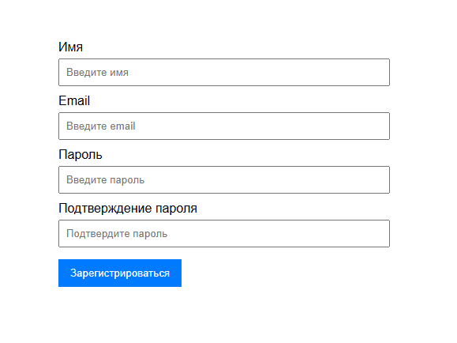
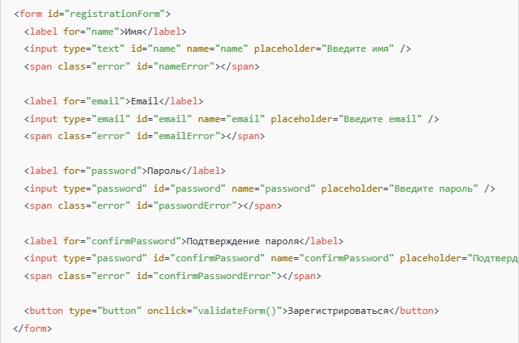
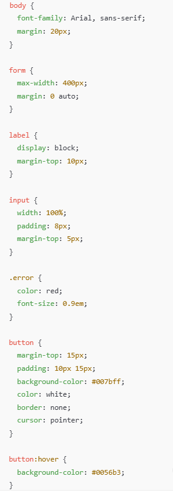

# Введение

В рамках моей тестовой работы для демонстрации своих навыков в области ручного тестирования, я решил создать простую форму регистрации и разместить её на платформе Glitch. Эта платформа позволила мне быстро настроить как клиентскую, так и серверную части, что дало возможность провести комплексные API тестирования.

Целью данного проекта было не только протестировать форму регистрации с точки зрения функциональности и интерфейса, но и проверить работу серверной части через API. Я создал сервер, который обрабатывает запросы, и реализовал все необходимые проверки, включая обработку ошибок, валидацию данных и взаимодействие с фронтендом.

В ходе выполнения задания я составил детальный тест-план, чек-листы и тест-кейсы, охватывающие как позитивные, так и негативные сценарии. Также были проведены кросс-браузерные тестирования и тесты на безопасность (например, защита от XSS-атак).

## Проект включает:

- Веб-форму регистрации с полями для имени, email, пароля и подтверждения пароля.
- Валидацию данных на клиентской и серверной сторонах.
- Реализацию серверных API для обработки данных.
- API тестирование с помощью Postman для проверки корректности работы серверных запросов и ответов.

Я подготовил все необходимые тесты для проверки как функциональности, так и безопасности формы регистрации. Этот проект стал отличной возможностью показать мой опыт в тестировании веб-приложений, включая работу с API, а также понимание принципов безопасности и качества пользовательского интерфейса.

# Форма регистрации
Этот сайт представляет собой простую веб-форму регистрации пользователей, с использованием HTML, CSS и JavaScript. Он взаимодействует с серверной частью для обработки регистрации, отправляя данные на сервер через API

### URL проекта: https://dot-tropical-ocicat.glitch.me

## HTML-структура:

- Форма регистрации состоит из четырёх полей: имя, email, пароль и подтверждение пароля.
- Каждое поле сопровождается элементом  для отображения ошибок валидации, если пользователь введет неверные данные.
- Кнопка отправки формы вызывает функцию validateForm(), которая проверяет корректность введённых данных.

## CSS-стили:

Стили для формы регистрации задают простое и удобное оформление:
- Все элементы формы, включая поля ввода и кнопки, занимают всю ширину контейнера.
- Ошибки валидации выделяются красным цветом.
- Кнопка оформления заявки имеет фон синего цвета, который меняется при наведении.

## CSS-стили: JavaScript-валидация и отправка данных на сервер:

validateForm():
1. Очистка предыдущих ошибок: перед проверкой данных удаляются все предыдущие сообщения об ошибках.
2. Валидация:
- Проверяется, что имя не пустое.
- Для email проверяется, чтобы он был корректно отформатирован.
- Пароль проверяется на минимальную длину (8 символов).
- Пароли должны совпадать.
3. Если форма прошла валидацию, данные отправляются на сервер с помощью fetch(). Сервер принимает данные в формате JSON и, в зависимости от результата, показывает сообщение об успехе или ошибке.
