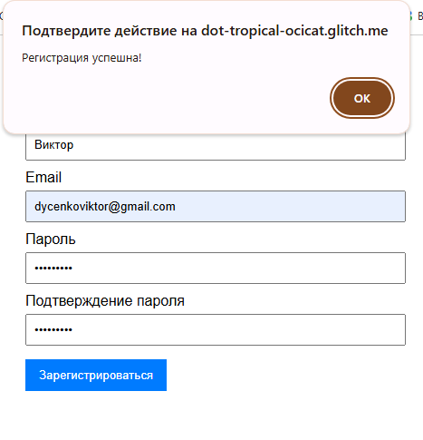
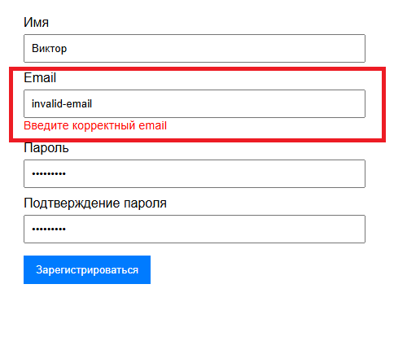

# Введение

В рамках моей тестовой работы для демонстрации своих навыков в области ручного тестирования, я решил создать простую форму регистрации и разместить её на платформе Glitch. Эта платформа позволила мне быстро настроить как клиентскую, так и серверную части, что дало возможность протестировать не только форму регистрации с точки зрения функциональности и интерфейса, но и проверить работу серверной части через API

В ходе выполнения задания я составил детальный тест-план, чек-листы и тест-кейсы, охватывающие как позитивные, так и негативные сценарии. Также были проведены кросс-браузерные тестирования и тесты на безопасность (например, защита от XSS-атак).

## Проект включает:

- Веб-форму регистрации с полями для имени, email, пароля и подтверждения пароля.
- Валидацию данных на клиентской и серверной сторонах.
- Реализацию серверных API для обработки данных.
- API тестирование с помощью Postman для проверки корректности работы серверных запросов и ответов.

# Форма регистрации
Этот сайт представляет собой простую веб-форму регистрации пользователей, с использованием HTML, CSS и JavaScript. Он взаимодействует с серверной частью для обработки регистрации, отправляя данные на сервер через API

- URL проекта: https://dot-tropical-ocicat.glitch.me

## HTML-структура:

- Форма регистрации состоит из четырёх полей: имя, email, пароль и подтверждение пароля.
- Каждое поле сопровождается элементом  для отображения ошибок валидации, если пользователь введет неверные данные.
- Кнопка отправки формы вызывает функцию validateForm(), которая проверяет корректность введённых данных.

## CSS-стили:

Стили для формы регистрации задают простое и удобное оформление:
- Все элементы формы, включая поля ввода и кнопки, занимают всю ширину контейнера.
- Ошибки валидации выделяются красным цветом.
- Кнопка оформления заявки имеет фон синего цвета, который меняется при наведении.

## JavaScript-валидация и отправка данных на сервер:

validateForm():
1. Очистка предыдущих ошибок: перед проверкой данных удаляются все предыдущие сообщения об ошибках.
2. Валидация:
- Проверяется, что имя не пустое.
- Для email проверяется, чтобы он был корректно отформатирован.
- Пароль проверяется на минимальную длину (8 символов).
- Пароли должны совпадать.
3. Если форма прошла валидацию, данные отправляются на сервер с помощью fetch(). Сервер принимает данные в формате JSON и, в зависимости от результата, показывает сообщение об успехе или ошибке.

## API-соединение:

POST-запрос отправляется на сервер, который обработает данные регистрации. Адрес сервера указывается как https://mirror-spiced-brian.glitch.me/. Данные отправляются в формате JSON.

# Серверная часть
## Импорт зависимостей:

Здесь импортируются необходимые зависимости:

- express: используется для создания серверных маршрутов и обработки HTTP-запросов.
- body-parser: модуль для парсинга тела запроса, в частности JSON, что необходимо для работы с данными, отправляемыми в POST-запросах.
- sqlite3: модуль для работы с базой данных SQLite, который позволяет использовать SQL-запросы для сохранения и извлечения данных.
- cors: модуль, который разрешает кросс-доменные запросы, что важно, если клиентская часть и сервер находятся на разных доменах.

## Создание экземпляра Express и настройки:

- app — это экземпляр Express, который будет использоваться для создания серверных маршрутов.
- cors({ origin: "*" }): разрешает доступ к серверу с любых доменов. Это полезно для разработки, но в реальных условиях нужно указать конкретные домены.
- bodyParser.json(): парсит входящие JSON-запросы, позволяя извлекать данные из тела запроса.

## Создание базы данных и таблицы:

- Создаётся база данных SQLite с именем users.db. Если база уже существует, устанавливается соединение с ней.
- db.run(...): создаёт таблицу users, если она ещё не существует. В таблице хранятся данные пользователей: id (уникальный идентификатор), name (имя пользователя), email (электронная почта) и password (пароль).

## Маршрут для регистрации:

1. Этот маршрут обрабатывает POST-запросы по адресу /register. Он принимает данные от клиента: name, email, password и confirmPassword.
2. Применяется валидация:
- Проверяется наличие имени.
- Проверяется формат email с помощью регулярного выражения.
- Проверяется длина пароля (не менее 8 символов).
- Проверяется совпадение паролей.
3. Если все проверки проходят успешно, данные пользователя сохраняются в базе данных SQLite. В случае успеха сервер возвращает сообщение о том, что регистрация прошла успешно. Если возникла ошибка при добавлении данных в базу, отправляется ошибка.

## Маршрут для получения списка пользователей:

- Этот маршрут обрабатывает GET-запросы по адресу /users. Он извлекает все записи из таблицы users и отправляет их в ответе.
- В случае ошибки извлечения данных из базы данных, возвращается сообщение об ошибке.

## Обработчик для корневого маршрута:

- Этот маршрут используется для проверки работы сервера. Если обратиться по корневому маршруту, сервер вернёт сообщение "Сервер работает!".

## Запуск сервера:

- Сервер запускается на порту 3000 (или на порту, указанном в переменной окружения PORT).
- При успешном запуске выводится сообщение в консоль, что сервер работает.

## Файл package.json:

- Этот файл содержит информацию о проекте и его зависимостях. В секции scripts определено, что для запуска сервера нужно использовать команду node server.js.
- В dependencies перечислены используемые модули: express, body-parser, sqlite3 и cors.

# Тестовая документация

Таким образом, в ходе разработки проекта, для проверки функциональности и обеспечения качества работы формы и API я перешел к составлению тестовой документации, которая охватывает следующие аспекты:

- Тестирование формы регистрации: Включает проверки корректности ввода данных пользователем, таких как имя, email, пароль и подтверждение пароля. Также проводится тестирование на корректность отображения ошибок и обработки некорректных данных.

- Тестирование API: Проверка корректности работы серверной части, включая валидацию данных на сервере, обработку запросов, сохранение данных в базе данных и ответы на запросы. Включает как позитивные, так и негативные тесты, чтобы убедиться, что система правильно обрабатывает все типы данных и ошибок.

- На основе функциональности формы регистрации и серверной части я создал тестовые случаи и чек-листы, охватывающие основные сценарии взаимодействия с системой. Тестирование включает как проверку работы интерфейса, так и тестирование API.

## Тест-план:

### 1. Общие сведения
1. Название проекта: Тестирование формы регистрации
2. Описание: Тестирование функциональности, валидации данных, пользовательского интерфейса и серверного взаимодействия формы регистрации.
3. Версия документа: 1.0
4. Дата составления: 20.11.2024
5. Ответственный: Дыченко В.И.
6. Термины и определения:
- UX (User Experience): Опыт взаимодействия пользователя с системой.
- UI (User Interface): Пользовательский интерфейс.
- XSS: Межсайтовый скриптинг (атака, позволяющая выполнить вредоносный JavaScript-код).
- API: Интерфейс программирования приложений.

### 2. Цель тестирования
- Убедиться, что форма регистрации работает корректно, удовлетворяет требованиям и предоставляет пользователю удобный интерфейс.
- Проверить правильность обработки данных как на клиентской стороне (валидация) так и на серверной (API).
- Убедиться в отсутствии уязвимостей XSS.

### 3. Объекты тестирования
1. Клиентская часть:
- Поля: "Имя", "Email", "Пароль", "Подтверждение пароля".
- Кнопка: "Зарегистрироваться".
- Сообщения об ошибках.
2. Серверная часть:
- API для регистрации пользователя.
- Запросы: POST, GET.

### 4. Ограничения
- Мобильная версия сайта не тестируется.
- Тестирование производительности и нагрузочного тестирования сервера не проводится.
- Проверка только на тестовом сервере, без взаимодействия с реальной базой данных.

### 5. Области тестирования
1. Функциональное тестирование:
- Валидация полей на клиентской и серверной стороне.
- Корректность сообщений об ошибках.
- Проверка отправки данных на сервер.
2. UX/UI тестирование:
- Удобство и доступность элементов формы.
- Визуальная корректность интерфейса.
3. Кроссбраузерное тестирование:
- Работа формы в Google Chrome, Mozilla Firefox, Microsoft Edge и Safari.
4. Серверное тестирование (API):
- Проверка корректности обработки запросов POST /register.
-  Валидация данных на стороне сервера.
5. Безопасность:
- Защита от XSS-атак.

### 6. Типы тестирования
1. Позитивное тестирование: Проверка формы с корректными данными.
2. Негативное тестирование: Проверка с некорректными данными (например, пустые поля, неверный формат email).
3. Тестирование безопасности: Ввод вредоносных данных в поля формы.
4. API-тестирование: Проверка работы с серверными запросами.

### 7. Тестовое окружение
1. Операционная система: Windows 10
2. Браузеры:
- Google Chrome (последняя версия)
- Mozilla Firefox
- Microsoft Edge
- Safari
3. Инструменты:
- Bugzilla, JIRA (для учета багов)
- Postman (для API-тестирования)
- TestRail (для управления тест-кейсами)

### 8. Критерии начала и завершения тестирования
1. Критерии начала:
- Форма регистрации доступна для тестирования.
- Настроен тестовый сервер.
- Подготовлены тестовые данные и окружение.
2. Критерии завершения:
- Все тест-кейсы выполнены.
- Все баги высокого и критического приоритета устранены.
- Проведено повторное тестирование после исправлений.

### 9. Риски
- Задержки из-за критических дефектов, мешающих тестированию.
- Ограничения в тестовом окружении (устаревшие браузеры).
- Неполная документация по API.

### 10. Результаты
1. Ожидаемые результаты:
- Все баги устранены.
- Валидация данных работает корректно.
- API корректно обрабатывает запросы и возвращает правильные ответы.
- Пользовательский интерфейс удобен и соответствует требованиям.
2. Рекомендации:
- Провести тестирование мобильной версии сайта.
- Расширить тестирование API для оценки производительности.

- Ссылка на тест-план: https://docs.google.com/document/d/1rZaS7SEOOVc_AMaZOvB1QA2uKWZ5PUR-owhR1kbRH8c/edit?tab=t.0

## Чек-листы:
### Чек-лист для функционального тестирования (клиентская часть)

### Чек-лист для UX/UI тестирования

### Чек-лист для кроссбраузерного тестирования

### Чек-лист для серверного тестирования (API)

- Ссылка на чек-листы: https://docs.google.com/document/d/1BaBD3Bmn_ZwCvDnhdXQq0nnMkMswQHk3sVdj6233ev8/edit?tab=t.0

## Тест-кейсы:
- Функциональное тестирования

- UX/UI тестирование

- Кроссбраузерное тестирование

- Серверное тестирование (API)

- Ссылка на тест-кейсы: https://docs.google.com/spreadsheets/d/10KoaP0LkXU2yAiv7zhEwtv7Yo1l2oUoDbVeeov7NLdg/edit?gid=0#gid=0

# Проведение тестов

## Клиентская часть:
Начиная с тест-кейса FCL_01 по FCL_06 форма отрабатывала корректно и выдавала ожидаемый результат:

1. FCL_01 (Отправка формы с пустыми полями)
- Результат: Форма работает корректно. Уведомления об ошибках отображены во всех полях.

2. FCL_02 (Отправка формы с корректными данными)
- Результат: Форма работает корректно. Регистрация пройдена.

3. FCL_03 (Ввод некорректного email)
- Результат: Форма работает корректно. Отображается сообщение: "Введите корректный email"

4. FCL_04 (Пароль менее 8 символов)
- Результат: Форма работает корректно. Отображается сообщение: "Пароль должен содержать не менее 8 символов"

5. FCL_05 (Несовпадение паролей)
- Результат: Форма работает корректно. Отображается сообщение: "Пароли не совпадают"

6. FCL_06 (Проверка обязательности поля "Имя")
- Результат: Форма работает корректно. При отсутствии значения в поле отображается сообщение об ошибке: "Имя обязательно для заполнения".
  

7. FCL_07 (Ввод пробелов в поле "Имя")
- Описание проблемы: Результат выполнения тест-кейса отличается от ожидаемого. При вводе только пробелов в поле "Имя", регистрация недоступна, что соответствует ожидаемому поведению формы. Однако сообщение об ошибке идентично случаю из тест-кейса FCL_06: "Имя обязательно для заполнения".
  
- Анализ: Поле "Имя" не распознаёт пробелы как недопустимые символы, а скорее "игнорирует" их, считая значение пустым. Если валидационная логика формы должна строго запрещать ввод пробелов (в качестве единственного содержимого), то текущее поведение можно рассматривать как нарушение бизнес-логики и недостаточную проверку пользовательского ввода.
  
### Рекомендации:
  Уточнить требования к полю "Имя".
  Если пробелы недопустимы, добавить соответствующую валидацию и выводить сообщение об ошибке, отличающееся от стандартного "Имя обязательно для заполнения".
  Ввести обработку случаев, когда поле содержит только пробелы, с явным указанием на некорректный формат данных.

